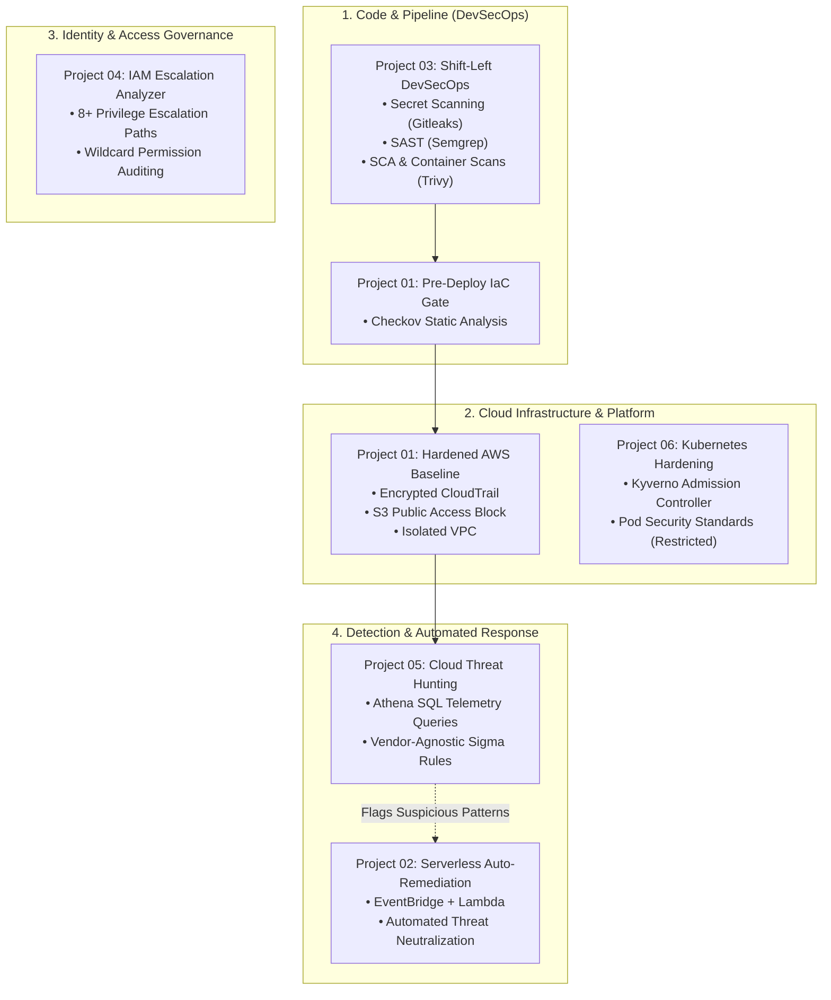

# Cloud & DevSecOps Security Engineering Portfolio

A curated collection of production-grade cloud security, DevSecOps, and detection engineering projects designed for real-world enterprise environments while remaining **100% free-tier and sandbox friendly**.

---

## Projects Directory

| # | Project | Domain | Key Technologies | Framework Alignment |
|---|---|---|---|---|
| **01** | [**AWS IaC Security Baseline & Posture Audit**](projects/01-aws-iac-posture-baseline/) | Infrastructure as Code & GRC | Terraform, Checkov, Boto3, Python | CIS AWS 3.0, NIST CSF |
| **02** | [**Serverless Event-Driven Auto-Remediation (SOAR)**](projects/02-serverless-auto-remediation/) | Detection & Active Defense | EventBridge, Lambda, Python, Slack API | MITRE ATT&CK T1078 |
| **03** | [**Shift-Left DevSecOps Pipeline**](projects/03-shift-left-devsecops-pipeline/) | Software Supply Chain Security | GitHub Actions, Semgrep, Gitleaks, Trivy, Docker | NIST SSDF, OWASP Top 10 |
| **04** | [**AWS IAM Least-Privilege & Escalation Analyzer**](projects/04-iam-least-privilege-analyzer/) | Cloud Identity & Access Management | Python, Boto3, Graph Analysis | MITRE ATT&CK T1078, T1098 |
| **05** | [**Cloud Threat Hunting & Detection Engineering**](projects/05-cloud-detection-engineering/) | Security Operations (SOC) & SIEM | Amazon Athena, AWS Glue, Sigma Rules | MITRE ATT&CK Cloud Matrix |
| **06** | [**Kubernetes Security Hardening & Admission Control**](projects/06-k8s-pod-security-hardening/) | Container & Platform Security | Kind, Kyverno, Pod Security Standards | K8s Restricted PSS, CIS K8s |

---

## Architecture & Domain Coverage

---

## Project Highlights

### [Project 01: AWS IaC Baseline & Posture Auditing](projects/01-aws-iac-posture-baseline/)
* **Problem**: Cloud environments suffer from insecure defaults (unencrypted logs, permissive security groups, missing MFA).
* **Solution**: Provisions a secure, cost-optimized AWS foundation using Terraform, guards commits with Checkov pre-merge CI gates, and includes a read-only Boto3 posture auditor.
* **Standout Artifact**: [Detailed Control Mapping](projects/01-aws-iac-posture-baseline/docs/control-mapping.md) documenting accepted trade-offs for lab environments.

### [Project 02: Serverless Event-Driven Auto-Remediation (SOAR)](projects/02-serverless-auto-remediation/)
* **Problem**: Time-to-detect and manual remediation latency leave organizations vulnerable when human error exposes critical infrastructure.
* **Solution**: EventBridge listens for high-risk CloudTrail events (e.g. `PutBucketAcl`, `AuthorizeSecurityGroupIngress`), automatically triggers AWS Lambda to seal public S3 buckets or revoke 0.0.0.0/0 rules, and pushes rich alert payloads to webhook channels in seconds.

### [Project 03: Shift-Left DevSecOps Pipeline](projects/03-shift-left-devsecops-pipeline/)
* **Problem**: Vulnerabilities and secrets committed into production codebases introduce costly remediation cycles and supply chain risks.
* **Solution**: A multi-gate GitHub Actions CI pipeline executing Gitleaks secret detection, Semgrep SAST, Trivy SCA, multi-stage non-root container compilation, and container vulnerability scanning.

### [Project 04: AWS IAM Least-Privilege & Escalation Analyzer](projects/04-iam-least-privilege-analyzer/)
* **Problem**: Over-permissive IAM policies frequently contain subtle privilege escalation vectors (e.g. `PassRole` + `RunInstances` or `CreatePolicyVersion`) leading to full account takeover.
* **Solution**: A Python CLI tool that parses offline JSON policy documents or live AWS accounts, flagging 8+ critical escalation combinations and wildcard administrative access.

### [Project 05: Cloud Threat Hunting & Detection Engineering](projects/05-cloud-detection-engineering/)
* **Problem**: Enterprise SIEMs are expensive, making hands-on cloud threat hunting difficult in small labs.
* **Solution**: Uses Terraform to spin up a cost-controlled Amazon Athena workgroup and AWS Glue catalog. Implements production-tested SQL queries and Sigma rules to detect root account usage, impossible travel, CloudTrail defense evasion, and exfiltration.

### [Project 06: Kubernetes Security Hardening & Policy Enforcement](projects/06-k8s-pod-security-hardening/)
* **Problem**: Container breakout attacks exploit containers running as root or with host namespaces.
* **Solution**: A zero-cost local lab on Kind deploying Kyverno admission controllers. Enforces non-root execution, drops all Linux capabilities, and requires read-only root filesystems, validated against both vulnerable and compliant test pods.

---

## Safety & Cost Architecture

- **$0 to Minimal Cost**: Everything in this repository is designed to run in AWS Free Tier or completely offline (offline IAM analysis, local Kind clusters, mocked unit tests, and Athena queries capped at 1 GB).
- **Zero Hardcoded Secrets**: All scripts leverage environment-based credentials or AWS profiles (`boto3.Session`).
- **No Insecure Applies**: Insecure test fixtures exist purely as scanner benchmarks and must never be applied to live accounts.

---

## License

This project is licensed under the MIT License — see the [LICENSE](LICENSE) file for details.
