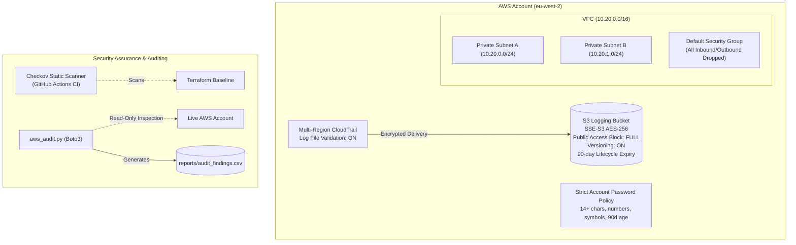

# Project 01: AWS IaC Security Baseline & Posture Auditing

[](https://www.terraform.io/)
[](https://www.checkov.io/)
[](docs/control-mapping.md)
[](https://www.python.org/)

A free-tier-friendly cloud security baseline engineered in Terraform, featuring automated **Checkov static analysis** in CI/CD, a read-only **Boto3 security posture auditor**, and formal **CIS / NIST CSF governance mapping**.

---

## Architecture Overview



---

## Key Features

1. **Hardened AWS Infrastructure Baseline (`terraform/baseline/`)**:
   - **CloudTrail**: Multi-region trail with global service events and SHA-256 log file validation enabled.
   - **S3 Bucket**: Complete public access block (`block_public_acls`, `block_public_policy`, `ignore_public_acls`, `restrict_public_buckets`), AES-256 server-side encryption, versioning, and 90-day lifecycle expiration.
   - **IAM Security**: Account-wide password policy enforcing 14+ characters, uppercase, lowercase, numbers, symbols, 90-day password expiration, and 24-generation reuse prevention.
   - **Network Isolation**: Dual private subnets with default security group ingress and egress locked down to prevent lateral movement.

2. **Scanner Verification Harness (`terraform/insecure-example/`)**:
   - Contains intentional vulnerabilities (world-open SSH `0.0.0.0/0`, public unencrypted bucket) to verify scanner detection.

3. **CI/CD Security Automation**:
   - Pre-merge static analysis with **Checkov** against the baseline and insecure test fixtures.

4. **Python Cloud Security Posture Auditor (`scripts/aws_audit.py`)**:
   - Inspects live AWS accounts for missing MFA, stale credentials (>90 days), public S3 buckets, and exposed management ports.

5. **Assurance & GRC Documentation (`docs/`)**:
   - [Control Mapping](docs/control-mapping.md) aligned to CIS AWS Foundations and NIST CSF.
   - [Sample Risk Register](docs/risk-register-sample.md) illustrating residual risk management.

---

## Quickstart & Verification

### 1. Format and Validate Terraform
```bash
cd terraform/baseline
terraform init
terraform fmt -check
terraform validate
terraform plan
```

### 2. Run Static Security Analysis Locally
```bash
pipx install checkov
# Baseline scan - passes with documented accepted risks
checkov -d terraform/baseline

# Insecure example - demonstrates findings detection
checkov -d terraform/insecure-example --soft-fail
```

### 3. Run Posture Audit Script
Requires read-only AWS credentials (e.g., `SecurityAudit` managed policy):
```bash
cd scripts
pip install -r requirements.txt
python aws_audit.py
# Findings exported to reports/audit_findings.csv
```
