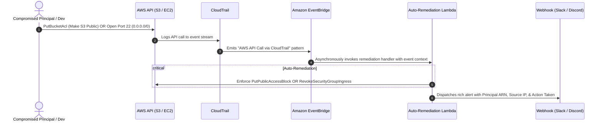

# Project 02: Serverless Event-Driven Auto-Remediation (SOAR)

[](https://aws.amazon.com/eventbridge/)
[](https://aws.amazon.com/lambda/)
[](https://www.terraform.io/)
[](https://www.python.org/)

An automated incident response and active defense pipeline. Detects security misconfigurations and dangerous API calls in near real-time, automatically neutralizes the threat, and dispatches incident alerts to SecOps channels.

---

## Architecture Flow



---

## Remediations Implemented

| Threat Vector | Trigger Event | Automated Response | Severity |
|---|---|---|---|
| **Public S3 Bucket Exposure** | `PutBucketAcl`, `PutBucketPolicy`, `DeleteBucketPublicAccessBlock` | Enforces all 4 settings of `PutPublicAccessBlock` (`BlockPublicAcls`, `IgnorePublicAcls`, `BlockPublicPolicy`, `RestrictPublicBuckets`). | **CRITICAL** |
| **Insecure Management Ingress** | `AuthorizeSecurityGroupIngress` | Scans added rules; if ports 22 (SSH) or 3389 (RDP) are exposed to `0.0.0.0/0`, immediately calls `RevokeSecurityGroupIngress`. | **HIGH** |

---

## Directory Structure

```text
02-serverless-auto-remediation/
├── lambda/
│   ├── alert_dispatcher.py       # Helper for Slack/Teams/Discord incident notifications
│   ├── remediate_s3_public.py    # Auto-seals exposed S3 buckets
│   └── remediate_sg_open.py      # Auto-revokes 0.0.0.0/0 SSH/RDP rules
├── terraform/
│   ├── main.tf                   # EventBridge rules, Lambda functions, least-privilege IAM
│   ├── variables.tf
│   └── outputs.tf
├── events/
│   ├── s3_public_exposure_event.json  # Mock CloudTrail event for local testing
│   └── sg_open_ingress_event.json     # Mock EC2 ingress event for local testing
└── tests/
    └── test_remediation.py       # Offline unit tests
```

---

## How to Test Locally & Deploy

### 1. Run Unit Tests (Offline / Mocked)
Zero AWS credentials required:
```bash
python -m unittest discover -s tests
```

### 2. Deploy to AWS Sandbox
```bash
cd terraform
terraform init
terraform plan
terraform apply
```

### 3. Verify in AWS
1. Attempt to open port 22 to `0.0.0.0/0` on any security group in the region.
2. Within 5–10 seconds, refresh the Security Group rules in the AWS Console.
3. Observe that the rule was revoked and inspect the CloudWatch logs under `/aws/lambda/demo-sec-auto-remediate-sg-open`.
