# Project 03: Shift-Left DevSecOps Pipeline

[](https://github.com/features/actions)
[](https://github.com/gitleaks/gitleaks)
[](https://semgrep.dev/)
[](https://trivy.dev/)
[](https://www.docker.com/)

An end-to-end "shift-left" secure CI/CD pipeline demonstrating software supply chain security, automated static analysis (SAST), secret detection, dependency scanning (SCA), and container image hardening.

---

## Security Pipeline Architecture

```mermaid
graph LR
    Dev[Developer git push] --> G1[Gate 1: Secret Scan<br/>Gitleaks]
    G1 -->|No Secrets Found| G2[Gate 2: SAST<br/>Semgrep]
    G2 -->|Zero High/Crit SAST| G3[Gate 3: Dependency SCA<br/>Trivy fs]
    G3 -->|No Known Vulns| G4[Gate 4: Build Hardened Container<br/>Multi-Stage / Non-Root]
    G4 --> G5[Gate 5: Container Image Scan<br/>Trivy image scan]
    G5 --> Deploy[Ready for Promotion / Registry]
    
    style G1 fill:#4ade80,stroke:#16a34a,stroke-width:2px,color:#000
    style G2 fill:#4ade80,stroke:#16a34a,stroke-width:2px,color:#000
    style G3 fill:#4ade80,stroke:#16a34a,stroke-width:2px,color:#000
    style G4 fill:#60a5fa,stroke:#2563eb,stroke-width:2px,color:#000
    style G5 fill:#4ade80,stroke:#16a34a,stroke-width:2px,color:#000
```



---

## Security Gates Breakdown

| Gate | Tool | Target | Policy / Threshold |
|---|---|---|---|
| **1. Secret Detection** | **Gitleaks** | Repository commit history & diffs | **Blocks merge** on API keys, private keys, AWS tokens, or passwords. |
| **2. SAST** | **Semgrep** | Python application code (`sample-app/app.py`) | **Blocks merge** on CWE-78 (Command Injection), OWASP Top 10 vulnerabilities, and custom rules (`semgrep-rules.yaml`). |
| **3. SCA (Dependencies)** | **Trivy** | `sample-app/requirements.txt` | **Blocks merge** if any direct dependency contains a `HIGH` or `CRITICAL` severity CVE. |
| **4. Image Hardening** | **Docker** | Multi-stage `Dockerfile` | Runs as unprivileged user `appuser (UID 10001)`; minimal Debian bookworm runtime; no package managers or dev tools in final layer. |
| **5. Container Scan** | **Trivy** | Built container image | Evaluates container base OS packages and application dependencies. |

---

## Local Verification Commands

### 1. Run Secret Scan Locally
```bash
# Install gitleaks via brew/binary
gitleaks detect --source . -v
```

### 2. Run SAST Analysis Locally
```bash
pip install semgrep
semgrep scan --config p/security-audit --config security-configs/semgrep-rules.yaml sample-app/
```

### 3. Run Dependency Vulnerability Scan Locally
```bash
trivy fs sample-app/
```

### 4. Build and Inspect Hardened Container
```bash
cd sample-app
docker build -t sample-microservice:local .

# Verify non-root user execution
docker run --rm sample-microservice:local id
# Expected output: uid=10001(appuser) gid=10001(appgroup)
```
