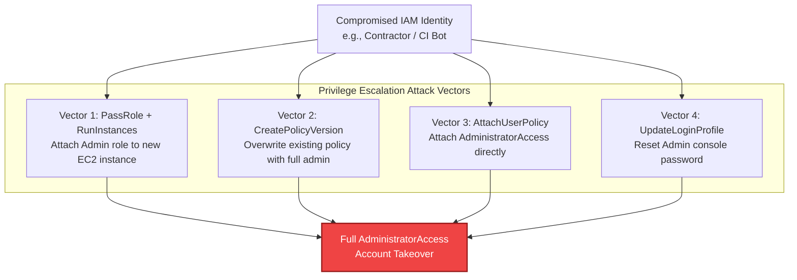

# Project 04: AWS IAM Least-Privilege & Attack Path Analyzer

[](https://www.python.org/)
[](https://attack.mitre.org/matrices/enterprise/cloud/)
[](https://aws.amazon.com/iam/)

A security analysis tool engineered to detect **Privilege Escalation paths**, administrative wildcard permissions (`*` on `*`), and dangerous policy combinations within AWS Identity and Access Management (IAM). 

Supports **offline JSON policy evaluation** (zero AWS account required) and **live AWS environment scanning**.

---

## The Threat: Cloud Privilege Escalation

In AWS environments, privilege escalation rarely involves software exploits; instead, adversaries leverage overly permissive IAM permissions to pivot into higher-privileged roles or grant themselves administrator access.



---

## Vectors Detected

| Attack Vector | MITRE ATT&CK | Description | Risk |
|---|---|---|---|
| **PassRole + EC2 RunInstances** | `T1078.004` | Launch an EC2 instance with an administrative instance profile and retrieve its STS credentials from the Instance Metadata Service (IMDS). | **CRITICAL** |
| **PassRole + Lambda CreateFunction** | `T1059.006` | Deploy a serverless function attached to a privileged execution role and invoke it to execute arbitrary commands. | **CRITICAL** |
| **CreatePolicyVersion** | `T1098` | Create a new version of an attached managed policy with `Action: *` and immediately designate it as the default version. | **CRITICAL** |
| **SetDefaultPolicyVersion** | `T1098` | Switch to an older, dormant high-privilege version of an existing policy. | **HIGH** |
| **AttachUserPolicy / PutUserPolicy** | `T1098` | Attach an existing admin policy or inject an inline policy granting broad privileges. | **CRITICAL** |
| **CreateAccessKey** | `T1098.001` | Generate long-lived programmatic credentials for higher-privileged IAM users. | **HIGH** |
| **UpdateLoginProfile** | `T1098` | Reset or create console passwords for target administrator identities. | **CRITICAL** |
| **Full Admin Wildcards (`*` on `*`)** | `T1078.004` | Grants root-equivalent privileges across all AWS APIs and resources. | **CRITICAL** |

---

## Usage

### 1. Run Offline on Sample Policies (Zero AWS Cost)
```bash
python iam_analyzer.py
```
Sample Terminal Output:
```text
===============================================================================================
                      AWS IAM LEAST-PRIVILEGE & ESCALATION AUDIT REPORT
===============================================================================================
Total Security Findings Identified: 4

POLICY NAME                  SEVERITY   ATTACK VECTOR                    MITRE     
-----------------------------------------------------------------------------------------------
privilege_escalation_passrol CRITICAL   PassRole to EC2 Instance         T1078.004 
  └─ Details: Attacker can launch an EC2 instance with an attached high-privilege IAM profile.

privilege_escalation_policyv CRITICAL   Create New Default Policy Versio T1098     
  └─ Details: Attacker can create a new version granting AdministratorAccess.
===============================================================================================
```

### 2. Scan a Custom Policy File or Directory
```bash
# Scan a single JSON policy
python iam_analyzer.py --file path/to/policy.json

# Scan a folder of policies
python iam_analyzer.py --dir path/to/policies/ --json
```

### 3. Scan a Live AWS Account (Read-Only)
Requires AWS credentials with `iam:ListPolicies` and `iam:GetPolicyVersion`:
```bash
python iam_analyzer.py --live
```

### 4. Run Automated Unit Tests
```bash
python -m unittest discover -s tests
```
