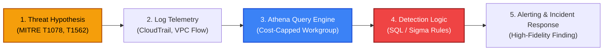

# Project 05: Cloud Threat Hunting & Detection Engineering

[](https://aws.amazon.com/athena/)
[](https://attack.mitre.org/matrices/enterprise/cloud/)
[](https://github.com/SigmaHQ/sigma)
[](https://www.terraform.io/)

A cloud detection engineering and threat hunting laboratory. Combines automated infrastructure provisioning for **Amazon Athena** and **AWS Glue**, enterprise SQL detection rules for CloudTrail and VPC Flow Logs, and vendor-agnostic **Sigma rules** mapped to MITRE ATT&CK for Cloud.

---

## Detection Engineering Lifecycle



---

## Detection Coverage Matrix

| Rule / SQL File | MITRE Technique | Threat Scenario | False Positive Mitigation |
|---|---|---|---|
| [`01_unauthorized_api_calls.sql`](detection_queries/01_unauthorized_api_calls.sql) | **T1087 / Discovery** | Adversary performing permission enumeration and API reconnaissance. | Grouped by identity & IP, thresholded to `>= 5` failures. |
| [`02_impossible_travel_logins.sql`](detection_queries/02_impossible_travel_logins.sql) | **T1078 / Valid Accounts** | Stolen console session or credentials logged in from geographically separated IPs within <60 minutes. | Joins on successful logins only; calculates exact minute differences. |
| [`03_root_account_usage.sql`](detection_queries/03_root_account_usage.sql) | **CIS 1.1 / T1078.004** | Use of break-glass AWS root account credentials for day-to-day operations or unauthorized access. | Filters out automated background `AwsServiceEvent` activity. |
| [`04_defense_evasion_cloudtrail_tamper.sql`](detection_queries/04_defense_evasion_cloudtrail_tamper.sql) | **T1562.001 / Impair Defenses** | Attacker executing `StopLogging` or `DeleteTrail` to hide malicious actions. | Monitors critical management events across CloudTrail service API. |
| [`05_vpc_flow_malicious_outbound.sql`](detection_queries/05_vpc_flow_malicious_outbound.sql) | **T1041 / Exfiltration** | Large data transfer (>100MB) from internal VPC assets to non-RFC1918 external IP addresses. | Filters out all private IP CIDRs (`10.0.0.0/8`, `172.16.0.0/12`, `192.168.0.0/16`). |

---

## Free-Tier & Cost Controls

Querying large petabyte-scale data lakes with Athena can incur significant per-query scan costs ($5 per TB). This project introduces strict guardrails in [`terraform/athena_setup.tf`](terraform/athena_setup.tf):
- **`bytes_scanned_cutoff_per_query = 1073741824`**: Hard query cutoff at **1 GB** (fractions of a cent), preventing accidental full-bucket table scans.
- **S3 Lifecycle**: Query outputs automatically expire after **14 days**.
- **SSE-S3 AES-256**: Zero-cost encryption for results.

---

## Deployment & Usage

### 1. Provision Athena Workgroup & Glue Catalog
```bash
cd terraform
terraform init
terraform plan
terraform apply
```

### 2. Run Queries via AWS CLI or Console
```bash
aws athena start-query-execution \
  --query-string file://../detection_queries/03_root_account_usage.sql \
  --work-group "sec-hunting-workgroup"
```
