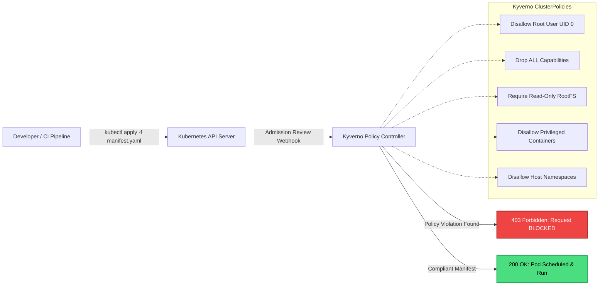

# Project 06: Kubernetes Security Hardening & Policy Enforcement

[](https://kubernetes.io/)
[](https://kyverno.io/)
[](https://kind.sigs.k8s.io/)
[](https://kubernetes.io/docs/concepts/security/pod-security-standards/)

A complete zero-cost container security laboratory running on a local **Kind** (Kubernetes in Docker) cluster. Enforces declarative admission control policies using **Kyverno** to achieve compliance with Kubernetes **Pod Security Standards (Restricted profile)**.

---

## Admission Control Architecture



---

## Hardening Policies Implemented

| Policy File | Category | Controls Enforced | MITRE / PSS Profile |
|---|---|---|---|
| [`disallow-root-user.yaml`](kyverno-policies/disallow-root-user.yaml) | Identity Hardening | Enforces `securityContext.runAsNonRoot: true` and blocks execution under UID 0. | **Restricted** (T1611) |
| [`drop-all-capabilities.yaml`](kyverno-policies/drop-all-capabilities.yaml) | Linux Kernel Security | Drops all default Linux kernel capabilities (`capabilities: drop: [ALL]`). | **Restricted** (T1611) |
| [`require-readonly-rootfs.yaml`](kyverno-policies/require-readonly-rootfs.yaml) | Immutability | Enforces `readOnlyRootFilesystem: true` to prevent malware drops and unauthorized runtime persistence. | **Restricted** (T1562) |
| [`disallow-privileged-containers.yaml`](kyverno-policies/disallow-privileged-containers.yaml) | Container Isolation | Prohibits `securityContext.privileged: true` to prevent node container escapes. | **Baseline** (T1611) |
| [`disallow-host-namespaces.yaml`](kyverno-policies/disallow-host-namespaces.yaml) | Host Isolation | Blocks sharing host PID, IPC, or Network namespaces (`hostPID`, `hostIPC`, `hostNetwork`). | **Baseline** (T1611) |

---

## Test Manifests Provided

- **Insecure Test Harness ([`manifests/insecure-pod.yaml`](manifests/insecure-pod.yaml))**:
  - Attempts to run as `root` (UID 0)
  - Requests `privileged: true`
  - Mounts host PID namespace (`hostPID: true`)
  - Writable root filesystem
- **Hardened Compliant Workload ([`manifests/hardened-pod.yaml`](manifests/hardened-pod.yaml))**:
  - Non-root user `appuser` (UID 10001)
  - Read-only root filesystem with `emptyDir` mount for temporary storage
  - All Linux capabilities explicitly dropped
  - Default seccomp profile applied (`RuntimeDefault`)

---

## One-Command Quickstart ($0 Cloud Spend)

### 1. Launch Cluster & Install Kyverno
```powershell
cd scripts
.\setup_cluster.ps1
```

### 2. Verify Policy Enforcement
```powershell
.\test_policies.ps1
```

Expected Terminal Output:
```text
[*] Testing Admission Control with INSECURE pod (Expected to FAIL)...
Error from server: error when creating "manifests/insecure-pod.yaml": admission webhook "validate.kyverno.svc-fail" denied the request: 

resource Pod/default/insecure-demo-pod was blocked:
1. disallow-root-user: Running as root is forbidden. Set 'securityContext.runAsNonRoot: true'.
2. disallow-privileged-containers: Privileged containers are strictly forbidden.
3. disallow-host-namespaces: Sharing host PID, IPC, or network namespaces is forbidden.
4. drop-all-capabilities: Containers must drop all Linux capabilities using 'capabilities.drop: [ALL]'.

[+] SUCCESS: Insecure Pod was successfully BLOCKED by Kyverno!

[*] Testing Admission Control with HARDENED pod (Expected to PASS)...
pod/hardened-demo-pod created
[+] SUCCESS: Compliant Hardened Pod was successfully ADMITTED!
```
