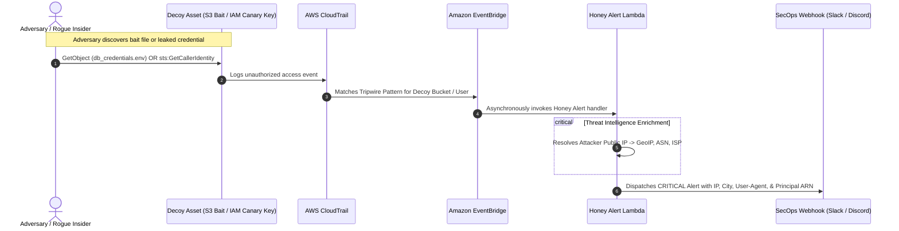

# Project 07: Cloud Deception Technology & Honeytokens

[](https://attack.mitre.org/techniques/T1530/)
[](https://aws.amazon.com/eventbridge/)
[](https://aws.amazon.com/lambda/)
[](https://attack.mitre.org/)

An enterprise **Cloud Deception & Tripwire Detection** architecture. Plants alluring decoy resources (Honey-buckets with fake database credentials and planted IAM canary access keys) across an AWS environment to detect intruders during initial reconnaissance with **zero false positives**.

---

## Deception Architecture



---

## Decoy Honeypots Deployed

| Honeytoken Type | Decoy Asset Name | Bait Data | Trigger Event | False Positive Rate |
|---|---|---|---|---|
| **S3 Honeytoken Bucket** | `canary-sec-internal-db-backups` | `credentials/production_database_master.env`<br/>`exports/q3_customer_financial_records.csv` | `GetObject`, `ListObjectsV2` | **0.0%** (No legitimate application ever references this bucket) |
| **IAM Tripwire Key** | `canary-sec-prod-admin-deployer` | Access Key ID & Secret planted in fake git repos, `.env` files, or internal wikis | Any AWS API call using the decoy credentials | **0.0%** (Has explicit `Deny *`; exists purely as an alert trigger) |

---

## Project Structure

```text
07-cloud-deception-honeytokens/
├── lambda/
│   └── honeytoken_alert.py       # EventBridge handler with GeoIP/ASN enrichment & alerting
├── terraform/
│   ├── main.tf                   # Decoy S3 bucket, bait files, tripwire IAM user, EventBridge
│   ├── variables.tf
│   └── outputs.tf
├── simulation/
│   └── trigger_canary.py         # Script to simulate attacker tripping the honeytoken
├── tests/
│   └── test_deception.py         # Offline mocked unit tests
└── README.md
```

---

## Testing & Verification

### 1. Run Offline Unit Tests
```bash
python -m unittest discover -s tests
```

### 2. Deploy Decoy Infrastructure
```bash
cd terraform
terraform init
terraform plan
terraform apply
```

### 3. Simulate Adversary Attack
```bash
cd ../simulation
python trigger_canary.py --bucket canary-sec-internal-db-backups-<ACCOUNT_ID>
```

Sample Alert Output in SecOps Webhook:
```json
{
  "alert_type": "DECEPTION_TRIPWIRE_TRIGGERED",
  "severity": "CRITICAL",
  "title": "🚨 [TRIPWIRE] Decoy Honeytoken 'S3: canary-sec-internal-db-backups/credentials/production_database_master.env' Accessed by 198.51.100.23",
  "incident_details": {
    "adversary_ip": "198.51.100.23",
    "adversary_geo": "Dublin, Ireland (Amazon.com)",
    "user_agent": "aws-cli/2.15.0",
    "event_time": "2026-10-04T19:30:00Z"
  },
  "recommendation": "IMMEDIATE INCIDENT RESPONSE: Block the source IP at WAF/VPC and isolate identity."
}
```
